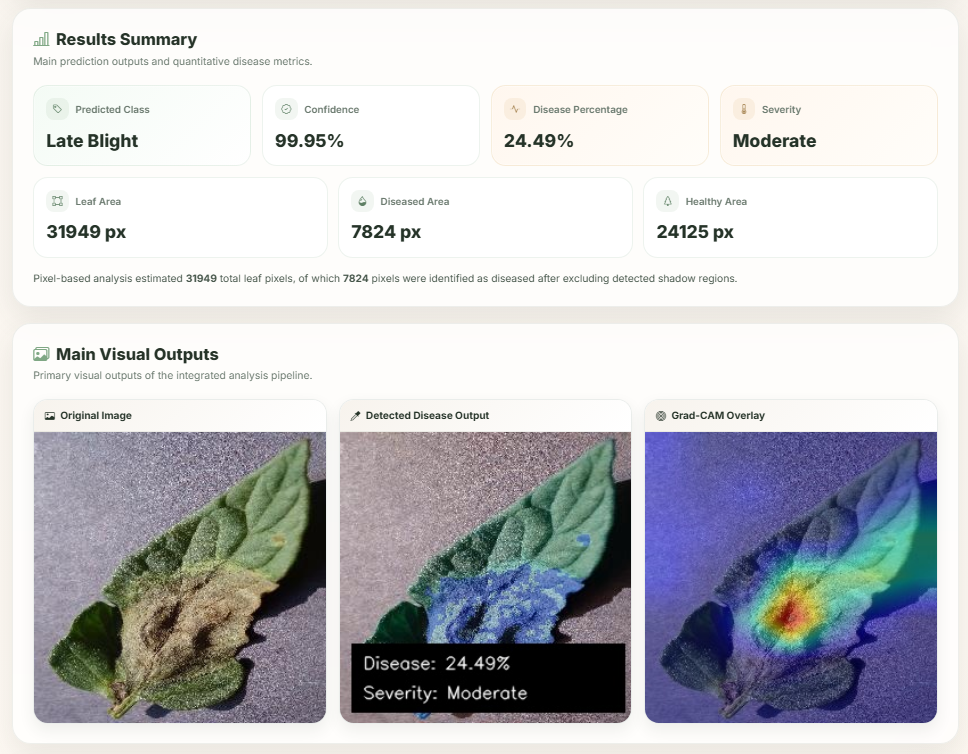
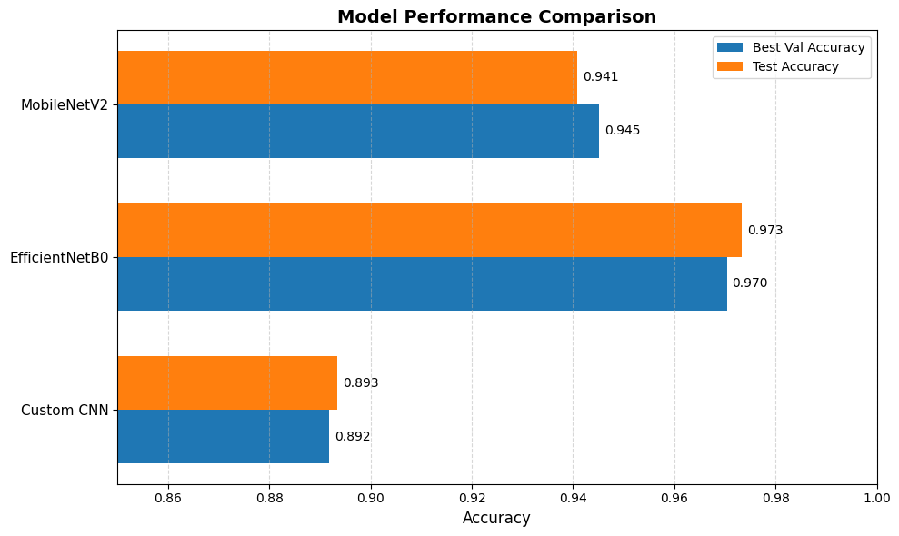

# 🌿 Tomato Leaf Disease Classification and Severity Analysis System

<p align="center">
  
  
  
  
</p>

<p align="center">
  
  
  
  
  
  
  
  
</p>

---

## 📌 Overview

This project is an end-to-end **computer vision system** built for **tomato leaf disease classification** and **severity analysis**.

It goes beyond a basic classifier by combining:
- **Image processing-based severity analysis**
- **Deep learning classification**
- **Explainable AI with Grad-CAM**
- **Prototype application integration**

The system not only predicts the leaf disease class, but also estimates:
- Leaf area
- Diseased area
- Healthy area
- Disease percentage
- Severity level

---

## ✨ Key Features

- Classifies tomato leaf images into:
  - **Early Blight**
  - **Late Blight**
  - **Healthy**
- Performs **pixel-based severity analysis**
- Measures diseased and healthy regions
- Uses **Grad-CAM** to highlight regions influencing predictions
- Compares multiple deep learning models
- Includes a prototype interface for image upload and analysis

---

## 🧠 Models Compared

This project evaluates three models:
- **Custom CNN**
- **MobileNetV2**
- **EfficientNetB0**

### ✅ Final Selected Model
**EfficientNetB0** (achieving the highest test accuracy of **97.34%**)

---

## 📊 Performance Summary

| Model | Final Train Accuracy | Best Validation Accuracy | Test Accuracy | Test Loss |
|------|----------------------:|-------------------------:|--------------:|----------:|
| Custom CNN | 0.8844 | 0.8919 | 0.8935 | 0.2477 |
| MobileNetV2 | 0.9536 | 0.9452 | 0.9408 | 0.1540 |
| **EfficientNetB0** | **0.9619** | **0.9704** | **0.9734** | **0.0888** |

---

## 🔬 Image Processing Pipeline

The image-processing workflow includes:
1. **Image preprocessing**
2. **Leaf segmentation**
3. **Shadow detection**
4. **Disease region extraction**
5. **Healthy green suppression**
6. **Morphological refinement**
7. **Pixel-based quantitative analysis**
8. **Severity label estimation**
9. **Final disease overlay generation**

### Quantitative outputs produced:
- **Leaf Area (px)**
- **Diseased Area (px)**
- **Healthy Area (px)**
- **Disease Percentage (%)**
- **Severity Label**

---

## 🖼️ Visual Gallery

Below are the visual outputs from the system's analysis pipeline.

<p align="center">
  
  
</p>

---

## 📁 Project Structure

```text
tomato-leaf-disease-analysis/
│
├── app/
│   ├── app_flask.py           # Main Flask application
│   ├── image_processing.py    # Image processing logic
│   ├── model_inference.py     # Model loading and prediction
│   ├── gradcam.py             # Grad-CAM implementation
│   ├── templates/             # HTML templates
│   └── static/                # Static assets (CSS, JS, results)
│
├── notebooks/
│   ├── model_train.ipynb      # Model training experiments
│   ├── model_evalution.ipynb  # Evaluation metrics and plots
│   └── image_processing.ipynb # Pipeline development
│
├── scripts/
│   ├── datasplit.py           # Dataset partitioning
│   ├── data_augment.py        # Image augmentation
│   └── class_weighting.py     # Handling class imbalance
│
├── outputs/                   # Performance logs and sample images
├── dataset/                   # Training dataset
├── final_model/               # Saved trained models
├── requirements.txt           # Dependencies
└── README.md                  # Project documentation
```

---

## 🚀 Getting Started

### Prerequisites
- Python 3.8+
- TensorFlow 2.x
- OpenCV

### Installation
1. Clone the repository:
   ```bash
   git clone https://github.com/Tharunchndrn/quantitative-botanical-reasoning.git
   ```
2. Install dependencies:
   ```bash
   pip install -r requirements.txt
   ```
3. Run the application:
   ```bash
   python app/app_flask.py
   ```

---

## 👨‍💻 Developer
**Tharun Chandran **